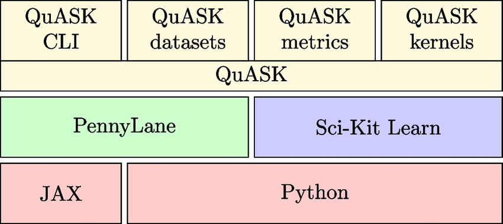

# Quask_anomaly_detection_embedding_optimizer_extensions
QuASK is an actively maintained library for constructing, studying, and benchmarking quantum kernel methods. Link: https://quask.readthedocs.io/en/latest/

